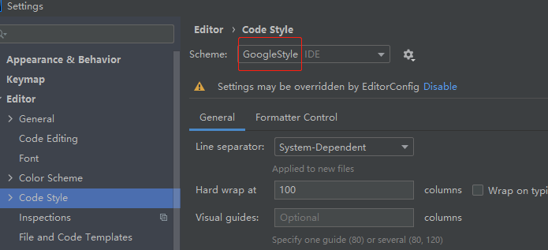

# 开发手册

## 开发准备

Houge 是采用 reactor 基于 AdoptOpenJDK 11 的版本开发，消息存储默认采用 MySQL 8 的版本。这里仅提供需要安装的软件的版本、名称与链接详细的安装步骤请参考各个官网的安装资料。

- [AdoptOpenJDK 11](https://adoptopenjdk.net/) Houge 开发默认使用的 JDK 版本
- [MySQL](https://www.mysql.com/) 消息存储数据库
- [websocat](https://github.com/vi/websocat) WebSocket 命令行工具
- [BloomRPC](https://github.com/uw-labs/bloomrpc) gRPC GUI 测试工具
- [Postman](https://www.postman.com/) HTTP/WebSocket GUI 接口测试工具
- IntelliJ IDEA
  - [Lombok](https://plugins.jetbrains.com/plugin/6317-lombok)
  - [Google Java Format](https://plugins.jetbrains.com/plugin/8527-google-java-format)
  - [SonarLint](https://www.sonarlint.org/intellij)

开发、测试工具，这里是个人平时习惯使用的工具，提供给大家的一个参考选项，具体可根据个人习惯选择性使用。

开发工具安装配置结束后需要手动在 MySQL 中创建数据库，可使用下面的 SQL 快速创建数据库。

```sql
create schema houge;
```

获取 Houge 源码：

```
$ git clone https://gitee.com/kk70/houge.git
```

### Google Java Format 配置

1. 去到 `File → Settings → Editor → Code Style`
2. 单击带有工具提示的扳手图标显示计划动作
3. 点击 `Import Scheme`
4. 选择项目根目录下 `config/intellij-java-google-style.xml` 文件
5. 确保选择 GoogleStyle 作为当前方案



### 安装 PostgreSQL

1. 创建数据卷
```
docker volume create pg-data
```

2. 启动 PostgreSQL 容器
```
docker run -d \
  --name postgres \
  -e POSTGRES_PASSWORD=123456 \
  -e PGDATA=/var/lib/postgresql/data/pgdata \
  -v pg-data:/var/lib/postgresql/data \
  -p 5432:5432 \
  postgres
```